## 1. Research topic and background

### 1.1 A capability arrives, and then a name

Making software by describing it in words was not invented in early 2025. GitHub Copilot emerged in June 2022, although it called itself an AI for proper programmers (Dohmke, 2022). ChatGPT, released late 2022, removed the requirement to own a code editor at all. By 2024, Anthropic's "Artifacts" feature removed even the last requirement, which was knowing how to run the code AI handed you (Anthropic, 2024). 2025 was the year of vibe coding, but only in name.

On 2 February 2025, former OpenAI cofounder Andrej Karpathy described a programming style where "you fully give in to the vibes... and forget that the code even exists". Just a year later he called that post a "throwaway tweet", comparing it to a proverbial shower thought: "I just fired off without thinking" (Karpathy, 2026). But Collins Dictionary disagreed, and they soon made it Word of the Year (Collins Dictionary, 2025). In engineering circles, it became an insult, with Peter Steinberger famously quipping "vibe coding is a slur" on the Lex Fridman podcast. His preference? The more restrained-sounding "agentic engineering" (Steinberger, 2026), a term that is in fact older, as it was used by Anthropic months before vibe coding's coinage (Anthropic, 2024).

Academics too have their opinions. The earliest academic treatment separates the two terms by model autonomy rather than human's rigour (Sapkota, Roumeliotis and Karkee, 2025). Meske et al. (2025) attempted a formal definition: software co-created by a person and a generative model through natural-language dialogue.

### 1.2 From end-user computing to "folk software"

This all happened before, and a research tradition already names most of it. End-user computing was the 1979 label for people outside IT building their own applications (McLean, 1979). In 1993, Barbara Nardi's study of spreadsheet usage popularised end-user programming too, treating its subjects as domain practitioners rather than deficient novices (Nardi, 1993). By the 2000s, end-user development became the umbrella term (Ko et al., 2011).

Every stage, though, assumed some tricky notation the person had to memorize. Vibe coding removed that altogether. And the artefacts that result are what I therefore consider "folk software", meaning small working software made by and for everyday people, for the maker or a household or a room rather than for a market. I borrow this term from art theory, namely folk art, an offshoot of outsider art, both categories defined by who makes a thing and for whom (Dundes, 1965). Two neighbouring terms admittedly come close to mine. "Situated software" classifies the program by the narrowness of the social world it serves, but its makers can code (Shirky, 2004). Meanwhile "ephemeral software" invokes the idea of software made for one occasion only, an element of some folk software but not essential (Compton and Mateas, 2015).

### 1.3 Objectives, research questions, and who is asking

This study counts public repositories reached by a builder-tool provenance signal within sampled date windows. It asks five questions. What do non-technical builders make? Who are these builders? Who is their folk software for? Is their folk software built to last, and does it? And does it travel beyond them? Visualisation shows how these artefacts are distributed for researchers and makers.

Sites, portfolios and small tools dominate readable names. Accounts look newer and quieter than the comparison groups, but occupation remains uncertain. Most checked apps load. Public traces of reuse are sparse.

Outside this MSc I run Vibe Coding Collective, a nonprofit and UK Community Interest Company whose filed purpose is to broaden access to practical software creation (Vibe Coding Collective CIC, 2026). That commitment motivates this question and creates a bias toward seeing non-professional making, which the analysis must test rather than assume.

## 2. Data sources

### 2.1 Where the data came from, and why it exists at all

Lovable, a hosted builder that turns a written description into a deployed web application, offers a button that connects a project to GitHub, creates a repository and writes its own default README into it (Lovable, 2026b). Searching public GitHub for that README finds everyone who pressed the button. The feature is not unique to Lovable: Base44, Bolt and v0 document the same sync or export (Base44, 2026; StackBlitz, 2026; Vercel, 2026), each leaving its trace, from which the contrast strata in 3.1 were drawn (Appendix B). Lovable is the population of interest because its trace is largest by an order of magnitude, 323,065 public repositories, and its sync is free on every plan.

The data exists because makers pressed that button, which is a selection effect rather than an ethical problem. Nobody chose to be studied, only to have a repository, a gate section 3.4 sizes.

The corpus is one dataset, 50,396 public repositories pulled from the authenticated GitHub REST API on 12 September 2026, published at `data/processed/corpus.csv` in the linked repository. The unit of analysis is the repository throughout.

### 2.2 Terms of service

GitHub's Acceptable Use Policies state that researchers may use public, non-personal information from the Service for research purposes only if any resulting publications are open access (GitHub, n.d.). This dataset was collected through the authenticated REST API, not scraping, holds no email addresses nor names, identifies owners only by salted hash, and is published open access with this report.

### 2.3 Anonymisation and personal data

The released copy holds repository metadata and derived features only, no README or code text, logins salted and hashed, and owner logins found inside published addresses and page titles were replaced, since a login is personal data under GitHub's own privacy statement. Processing follows the Data (Use and Access) Act 2025 and AoIR guidance (franzke et al., 2020).

### 2.4 Trustworthiness and validity

Two limits are actually design decisions rather than accidents, so are worth clarifying now. The corpus measures only makers who connected a Lovable project to GitHub, the fraction of Lovable's own claimed project count that 3.4 sizes, and provenance is scored not filtered, because a strict filter buys precision at recall cost (Munaiah et al., 2017). Section 4.2 compares account footprints. The exploratory weighted score cannot establish occupation. The category is contested, so the study answers for its indicators rather than the concept (Adcock and Collier, 2001).

## 3. Data overview and pre-processing

### 3.1 The corpus and its four strata

The corpus holds four strata, each drawn by a different provenance signal. The population of interest is the Lovable stratum, 42,264 repositories created between 10 June 2024 and 10 September 2026, each carrying Lovable's default README. Three tool-based contrast strata, collected the same day by the same method, hold 2,797 repositories from Replit, 2,776 from v0 and Bolt, and 2,559 from Claude Code. Every row carries the repository's fields, three account-level proxies for the maker, and a check of whether the published app still loads.

| | Lovable stratum (n = 42,264) |
|---|---|
| Zero stars | 96.5% |
| No description | 95.1% |
| No licence | 99.7% |
| Last push within one day of creation | 61.6% |
| Median repository size | 431 KB |
| TypeScript | 98.1% |

*Table 1. Summary statistics for the population of interest.*

### 3.2 Cleaning decisions, and the reason for each

Forks are excluded because copied provenance is not an independent act of making. Auto-generated names are retained in the corpus but excluded from genre shares. Core outcomes remain as observed. Missing and blocked URL checks are reported separately. Dead applications are kept, because whether a published application still loads is the indicator for question 4, a dead address being evidence, neither imputed nor removed.

### 3.3 Classifying projects by name

The first instrument is a dictionary matching whole words and stems, supplemented by page titles where available. Such lists require domain validation because they carry their author's assumptions (Grimmer and Stewart, 2013). Its 23 local families adapt Google Play's categories (Google, 2026; Martin et al., 2017), adding Site and portfolio, AI and chatbots, Trackers and dashboards, and Business and clients. It classifies 41.6% of Lovable rows after excluding auto-names. The separate dictionary validation sheet was not completed, so these are descriptive dictionary outputs.

The second instrument, Claude Sonnet 5, uses fixed vocabularies for kind, maker, audience and name style. Each task has 50 proportionally stratified, shuffled items, excluding auto-names. Kind, audience and naming stratify on dictionary family; maker on biography presence. Fixed seeds and allocations are preserved. I reviewed 200 answers in the blind evaluator, using source and app evidence where available (Figures A1 to A3).

Prompt development used the first 40 items, reported in four blocks of ten. These blocks do not establish independently refitted cross-validation. The target was mean agreement of 80%, with no block below 70%. Maker v2 and naming v3 passed; kind and audience v3 were retained as the best available below that bar. Table 2 reports their final ten-item evaluations, including Cannot tell as an answer, with Wilson intervals (Wilson, 1927) and Cohen's kappa (Cohen, 1960).

| Task | Development | Final ten | 95% interval | κ |
|---|---:|---:|---:|---:|
| Kind | 77.5% | 3/10 (30%) | 10.8–60.3% | 0.21 |
| Audience | 77.5% | 5/10 (50%) | 23.7–76.3% | 0.22 |
| Maker | 82.5% | 6/10 (60%) | 31.3–83.2% | 0.00 |
| Naming | 92.5% | 6/10 (60%) | 31.3–83.2% | 0.29 |

*Table 2. Agreement with final reference labels. Small evaluation sets produce wide uncertainty.*

Earlier full-run baselines contained predictions for kind's final items, so an untouched holdout cannot be established from the files. Weak final results make scale estimates exploratory. Inter-instrument agreement is not accuracy.

### 3.4 What the data does not contain, and what it cannot see

Only 25.3% of repositories declare a homepage, so whether the published app still loads is known for 11.9% of rows. Figure 1 sizes the larger gap, the corpus itself. Lovable claims 50 million projects (Lovable, 2026a). Public GitHub carries Lovable's README on 323,065 repositories, 0.65% of that claim, and this study holds 42,264 of those. The Internet Archive is a separate instrument, not a step in that chain, as it saw 33,530 hosts on Lovable's own domain whether or not they reached a repo.

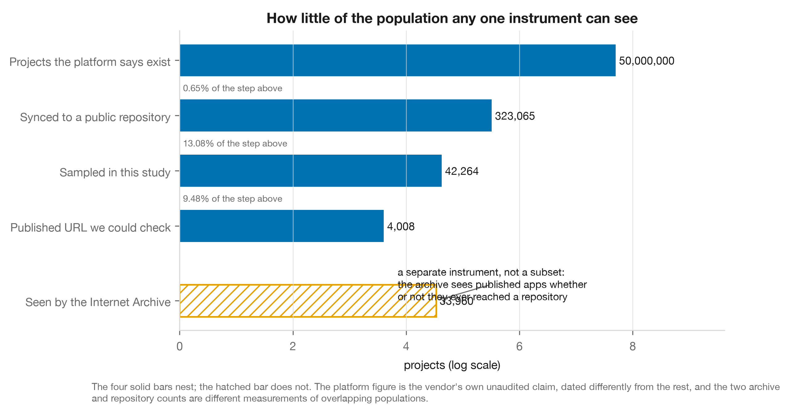

**Figure 1.** How little of the population any one instrument can see.

## 4. Analysis

### 4.1 What do non-technical builders make?

Figure 2 ranks the dictionary's genre families in the Lovable stratum against the same measure on the comparison strata. Among the projects the dictionary can classify, sites and portfolios are largest at 15.3%, ahead of AI and chatbots at 14.3%, creative and media at 11.9% and trackers and dashboards at 9.1%. The professional comparison inverts the top two, at 23.7% for AI and chatbots. On a seeded random sample of 1,000 names, the selected coder assigns families to 71.8%; Business and clients leads at 11.3% of those 718. The instruments agree on 256 of 403 jointly classified items (63.5%), while neither classifies 23.6% of the sample. Low final agreement prevents treating these as established category shares.

Figure 3 is descriptive. It counts the name wordings people use, and the words that name a product's form rather than its purpose make up 19.3% of all words used, with "hub" alone in 2,177 names, more than any word naming a purpose. Where a name sits on the trademark distinctiveness spectrum, generic, descriptive, suggestive, arbitrary or fanciful (*Abercrombie & Fitch Co. v. Hunting World, Inc.*, 1976), is a judgement rather than a count, made by the aligned coder on the precedent of Adarsh et al. (2024), who aligned a classifier to human labels on the same spectrum for technology brand names. The naming scale checkpoint contains 874 of 1,000 requested labels. Because it is incomplete, its category shares are not presented as population estimates.

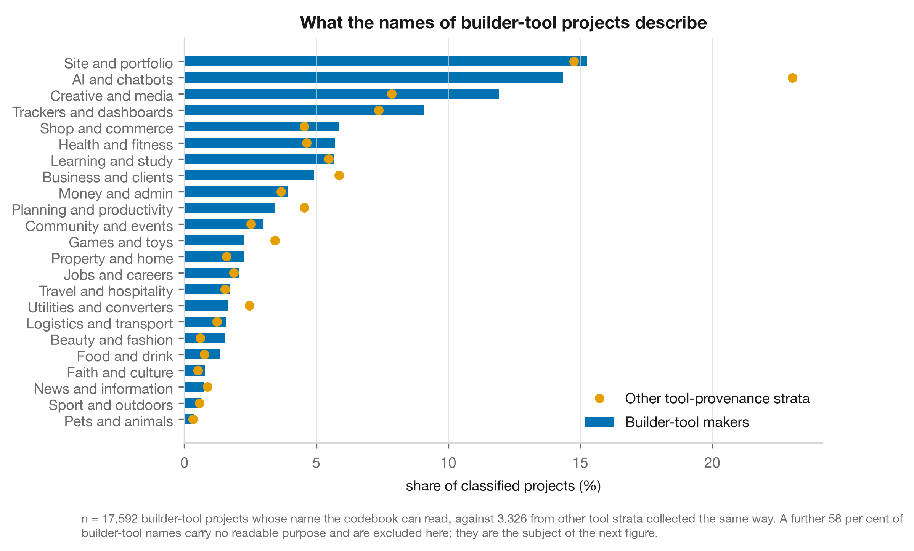

**Figure 2.** Dictionary categories in builder-tool repositories, among classifiable names.

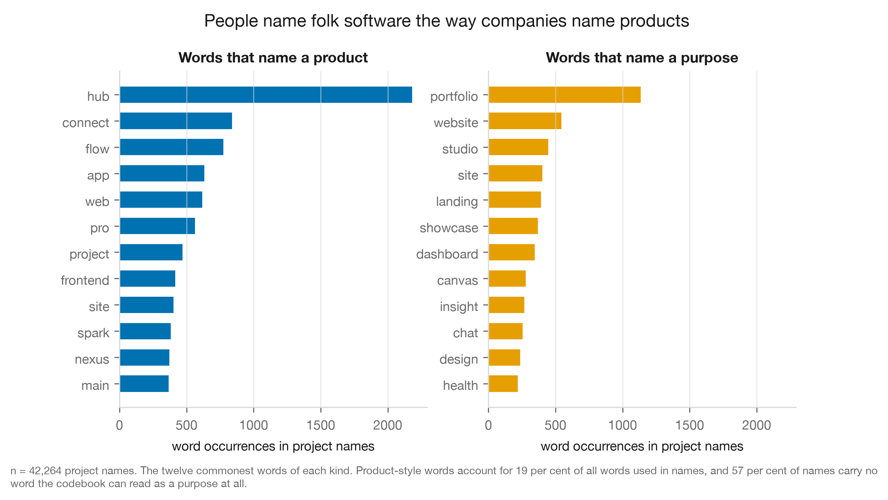

**Figure 3.** The twelve commonest product-form words and purpose words in Lovable project names. Descriptive, not a classification.

### 4.2 Who makes it?

Repository metadata cannot give demographics, so we go by proxy, on the three-way distinction end-user programming research draws between technical professionals, technical amateurs, and non-technical (Nardi, 1993; Ko et al., 2011; Scaffidi, Shaw and Myers, 2005). Figure 4 plots three account-level distributions across the four strata. Lovable makers hold a median of 10 public repositories where Claude Code users hold 18, one in five was working from an account under 30 days old when the project was created against one in nine, and followers and biographies run the same way. The account behind a Lovable project looks newer, quieter and less established than the account behind a professionally tooled one, with modest gaps.

Professionals occur here too, but no single trace identifies them (Appendix B). Of 50 maker reference labels, 35 are Cannot tell and none positively identifies a non-programmer. A professional-versus-non-programmer score therefore cannot be validated: uncertainty is not a negative class. The exploratory equal-weight score remains in the notebook, without occupational interpretation. Table 3 tests descriptive footprint definitions, light meaning no biography, at most one follower and under ten repositories, heavy meaning a biography with either ten followers or thirty repositories.

| | Fresh account, single project | Light footprint | Heavy footprint |
|---|---|---|---|
| Share of the Lovable stratum | 7% | 43% | 9% |
| Name points at a market | 2.2% | 2.5% | 2.9% |
| Name the codebook cannot read | 63% | 61% | 56% |
| Published address no longer loads | 22% | 18% | 15% |

*Table 3. Footprint sensitivity. The strictest filter keeps accounts created the same day as their only project.*

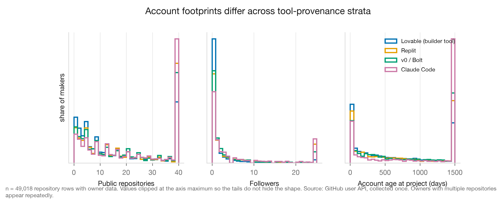

**Figure 4.** Account footprints across four tool-provenance groups collected the same day.

### 4.3 Who is folk software for?

Commercial intent is most often claimed about this population, but data is weak. Whom software is for is judged on von Hippel's two sectors, household, meaning for makers, family, friends or community at personal expense, and producer, meaning for business, clients or paying customers (von Hippel, de Jong and Flowers, 2012; von Hippel, 2017). Figure 5 tracks two monthly shares from the dictionary. Across the Lovable stratum, 2.6% of projects carry a name that points at a market and 2.2% a name pointing at a person or household, and the monthly series shows no gradient across the 23 months holding at least 30 observations. On the 1,000-name sample, the selected coder labels 22.1% producer-sector, 1.0% household-sector and 76.9% Cannot tell. Its final agreement is only 50%, so these are exploratory outputs rather than validated audience estimates.

The professional strata return the same 2.6%, which is the more troubling reading, since the dictionary may be tracking vocabulary rather than intent.

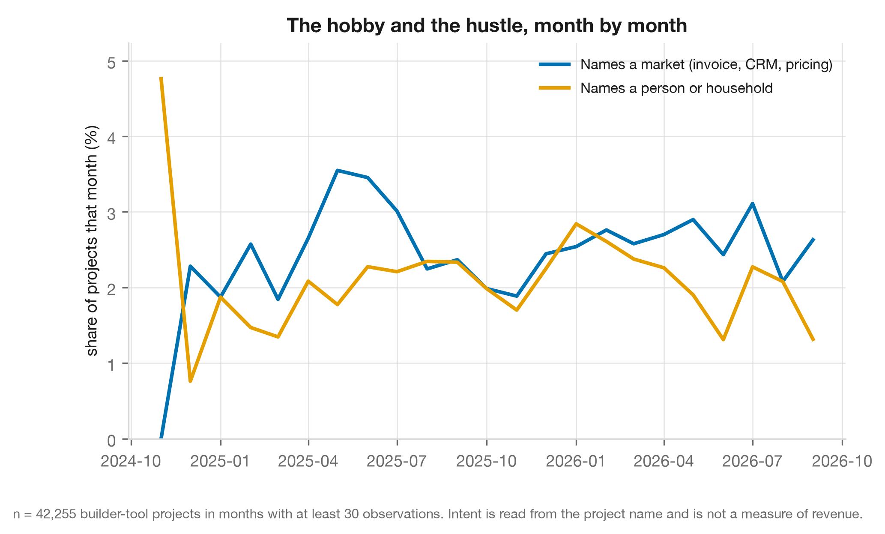

**Figure 5.** The hobby and the hustle, month by month.

### 4.4 Is folk software built to last, and does it?

Figure 6 shows the proportion classified dead among addresses with a determinate live/dead check, with Wilson intervals. Of 494 Replit addresses, 63.2% were dead, against 18.3% of 3,951 Lovable addresses, 16.9% of 991 for v0 and Bolt and 12.5% of 400 for Claude Code. Blocked and indeterminate checks are excluded from these denominators.

This is a single-date status comparison, not a survival estimate. Failure dates and reasons were not observed, so the gap cannot establish abandonment or a platform-policy cause. The monthly series in Figure 5 supplies the time-series analysis; repeated liveness checks would be needed to estimate survival.

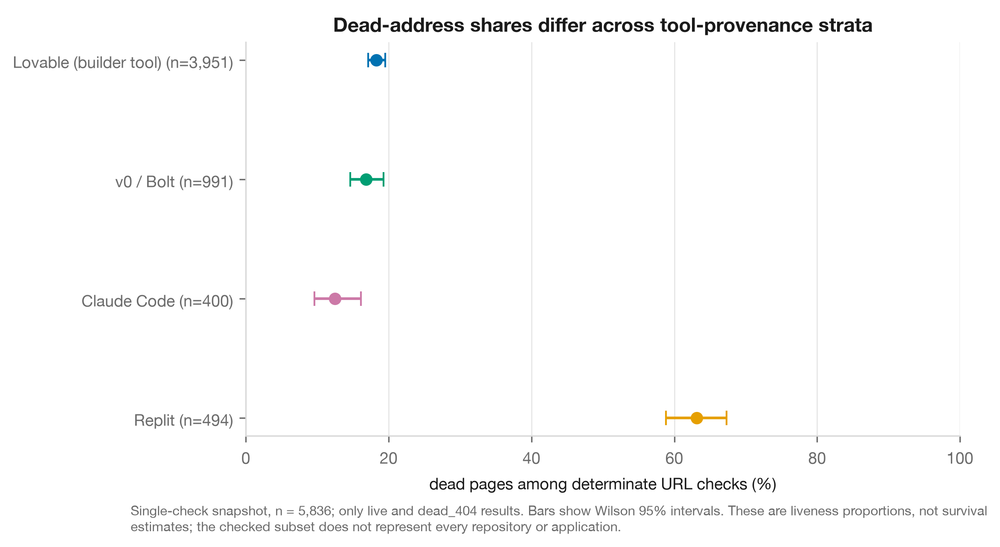

**Figure 6.** Dead-address share among determinate checks, by provenance stratum, with Wilson 95% intervals.

### 4.5 Does folk software travel beyond its maker?

A representative UK survey found only 17% of products people developed or modified at home ever reached anyone else (von Hippel, de Jong and Flowers, 2012). Figure 7 answers with four public traces of a project leaving its maker's hands. In the Lovable stratum, 22.6% have a published address, 3.5% have been starred by anyone, 2.7% have been forked and 4.9% carry a description. Footprint moves every trace the same way without changing order.

A published address does not demonstrate use, and GitHub stars and forks miss off-platform audiences. These traces cannot be compared directly with the survey's 17% diffusion measure, but show how little reuse is visible through this instrument.

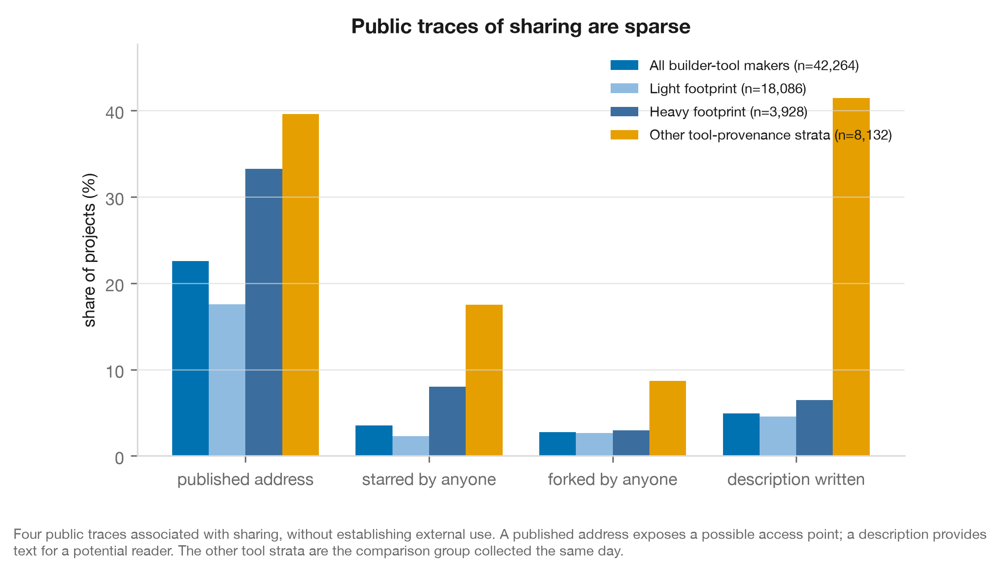

**Figure 7.** Public traces of publication and reuse, which do not measure total audience.

## 5. Conclusion and evaluation

### 5.1 Key findings

Readable names often describe portfolios, chatbots and trackers, from accounts newer and quieter than the comparison groups. Commercial vocabulary is rare, but the model estimates audience differently and generalises poorly. Replit addresses show higher observed failure, without establishing its cause. Stars and forks provide little evidence of reuse. These findings describe a visible builder-tool population; they do not establish its makers' occupations.

### 5.2 Evaluation of the process and the figures

Every figure comes from the notebook under a fixed seed, and no classifier was scored by itself. Three figures failed and were rebuilt: a coverage funnel that implied a containment which doesn't exist, a survival curve silently filtered to one stratum, which hid the main result, and a genre chart whose denominator didn't match text.

### 5.3 Limitations

The corpus gates on public GitHub publishing and sampled date windows. No field establishes occupation, and names leave about 59% outside dictionary shares. Two language tools, fastText (Joulin et al., 2017) and langid, disagreed on short names, so language share remains unmeasured. Liveness was checked once on 11.9% of all rows. One rater prevents inter-rater reliability estimates; ten-item final sets and weak agreement limit classification claims. Wilson intervals cover sampling uncertainty, not classification error.

### 5.4 Future work

A second phase, a survey and interview study of my organisation's members, meets each limitation in turn. It asks occupation, motive, audience and earnings directly and links them to the maker's own artefacts, and adds a second rater, longer text for language identification, a repeated survival check, and a three-group baseline of known non-coders, professionals hand-coding and professionals vibe-coding.

## 6. Critical engagement with AI

### 6.1 Declaration

AI use was logged throughout, the tool being Claude Code running claude-fable-5-1 on 9, 10, 12 and 13 September 2026. It ran research agents that searched literature and resolved citations, debated my outlines and ideas, and wrote code portions for data handling, and caught typos. An OpenAI Codex agent built the evaluator tool to my specification, and I thought it only fitting that I should vibe code that tool. OpenAI model was the latest Astra. For LLM judges, I used Anthropic Claude Sonnet 5. Despite this paper's topic, it was very important to me that I approached it in a human way. AI needs more humanity, I think, so I set the questions, made the definitional and ethical calls, supplied every label, checked the sources, edited every sentence, but also built the community org that led to me pursuing this kind of work at all.

### 6.2 Where AI was used, and where it was wrong

The most useful AI output was the record of its own failures. Its claim that no artefact-scale study existed was a third false, since one already did (Deng, Fan and Meng, 2026), caught only because every citation was resolved against a primary source. Generated analysis code failed quietly rather than loudly, matching "spa" inside "space" and returning a plausible distribution that looked like success. And two model coders were run over the whole stratum before alignment, which cost money and produced numbers this report refuses to use.

### 6.3 Reflexivity

Verification ran in my own direction too, finding a membership figure, a country count and three partnership claims undocumented in my organisation's records. A language model classifies software that language models wrote, and the two share blind spots, since generated boilerplate reads as sincerity and a template reads as a product. That is why development scores must be checked against final evaluations, and why weak agreement limits what model outputs can support.

## References

*Harvard. Not counted toward the word budget.*

*Abercrombie & Fitch Co. v. Hunting World, Inc.* (1976) 537 F.2d 4 (2d Cir.).

Adarsh, S., Ash, E., Bechtold, S., Beebe, B. and Fromer, J. (2024) 'Automating Abercrombie: machine-learning trademark distinctiveness', *Journal of Empirical Legal Studies*, 21(4), pp. 826-860. doi: 10.1111/jels.12398.

Adcock, R. and Collier, D. (2001) 'Measurement validity: a shared standard for qualitative and quantitative research', *American Political Science Review*, 95(3), pp. 529-546. doi: 10.1017/S0003055401003100.

Anthropic (2024) *Introducing Claude 3.5 Sonnet*, 20 June. Available at: https://www.anthropic.com/news/claude-3-5-sonnet (Accessed: 13 September 2026).

Base44 (2026) *GitHub integration*, Base44 documentation. Available at: https://docs.base44.com/developers/app-code/local-development/github.md (Accessed: 10 September 2026).

Cohen, J. (1960) 'A coefficient of agreement for nominal scales', *Educational and Psychological Measurement*, 20(1), pp. 37-46. doi: 10.1177/001316446002000104.

Collins Dictionary (2025) *Collins Word of the Year 2025: AI meets authenticity as society shifts*, 6 November. Available at: https://blog.collinsdictionary.com/language-lovers/collins-word-of-the-year-2025-ai-meets-authenticity-as-society-shifts/ (Accessed: 13 September 2026).

Compton, K. and Mateas, M. (2015) 'Casual creators', *Proceedings of the Sixth International Conference on Computational Creativity (ICCC 2015)*, Park City, Utah, 29 June to 2 July, pp. 228-235. Available at: https://computationalcreativity.net/iccc2015/proceedings/10_2Compton.pdf (Accessed: 10 September 2026).

Deng, J., Fan, Z. and Meng, R. (2026) *Understanding the (in)security of vibe-coded applications*. arXiv:2606.23130. Available at: https://arxiv.org/abs/2606.23130 (Accessed: 10 September 2026).

Dohmke, T. (2022) *GitHub Copilot is generally available to all developers*, GitHub Blog, 21 June. Available at: https://github.blog/news-insights/product-news/github-copilot-is-generally-available-to-all-developers/ (Accessed: 13 September 2026).

Dundes, A. (1965) *The Study of Folklore*. Englewood Cliffs, NJ: Prentice-Hall.

franzke, a.s., Bechmann, A., Zimmer, M., Ess, C. and the Association of Internet Researchers (2020) *Internet research: ethical guidelines 3.0*. Available at: https://aoir.org/reports/ethics3.pdf (Accessed: 10 September 2026).

GitHub (n.d.) *GitHub Acceptable Use Policies*, section 'Information Usage Restrictions'. Available at: https://docs.github.com/en/site-policy/acceptable-use-policies/github-acceptable-use-policies (Accessed: 13 September 2026). The page carries no effective date.

Google (2026) *Choose a category and tags for your app or game*, Play Console Help. Available at: https://support.google.com/googleplay/android-developer/answer/9859673 (Accessed: 13 September 2026).

Grimmer, J. and Stewart, B.M. (2013) 'Text as data: the promise and pitfalls of automatic content analysis methods for political texts', *Political Analysis*, 21(3), pp. 267-297. doi: 10.1093/pan/mps028.

Joulin, A., Grave, E., Bojanowski, P. and Mikolov, T. (2017) 'Bag of tricks for efficient text classification', *Proceedings of the 15th Conference of the European Chapter of the Association for Computational Linguistics: Volume 2, Short Papers*, pp. 427-431. doi: 10.18653/v1/E17-2068.

Kaplan, E.L. and Meier, P. (1958) 'Nonparametric estimation from incomplete observations', *Journal of the American Statistical Association*, 53(282), pp. 457-481. doi: 10.1080/01621459.1958.10501452.

Karpathy, A. (2025) *There's a new kind of coding I call 'vibe coding'*. [Post on X], 2 February. Available at: https://x.com/karpathy/status/1886192184808149383 (Accessed: 13 September 2026).

Karpathy, A. (2026) *One year of vibe coding, a retrospective*. [Post on X], 4 February. Available at: https://x.com/karpathy/status/2019137879310836075 (Accessed: 13 September 2026).

Ko, A.J., Abraham, R., Beckwith, L., Blackwell, A., Burnett, M., Erwig, M., Scaffidi, C., Lawrance, J., Lieberman, H., Myers, B., Rosson, M.B., Rothermel, G., Shaw, M. and Wiedenbeck, S. (2011) 'The state of the art in end-user software engineering', *ACM Computing Surveys*, 43(3), pp. 1-44. doi: 10.1145/1922649.1922658.

Lovable (2026a) *The build economy*, 9 June. Available at: https://thebuildeconomy.lovable.app/ (Accessed: 10 September 2026).

Lovable (2026b) *GitHub integration*, Lovable documentation. Available at: https://docs.lovable.dev/integrations/git-integration (Accessed: 10 September 2026).

Martin, W., Sarro, F., Jia, Y., Zhang, Y. and Harman, M. (2017) 'A survey of app store analysis for software engineering', *IEEE Transactions on Software Engineering*, 43(9), pp. 817-847. doi: 10.1109/TSE.2016.2630689.

McLean, E.R. (1979) 'End users as application developers', *MIS Quarterly*, 3(3), pp. 37-46. doi: 10.2307/248712.

Meske, C., Hermanns, T., von der Weiden, E., Loser, K.-U. and Berger, T. (2025) 'Vibe coding as a reconfiguration of intent mediation in software development: definition, implications, and research agenda', *IEEE Access*, 13, pp. 213242-213259. doi: 10.1109/ACCESS.2025.3645466.

Munaiah, N., Kroh, S., Cabrey, C. and Nagappan, M. (2017) 'Curating GitHub for engineered software projects', *Empirical Software Engineering*, 22(6), pp. 3219-3253. doi: 10.1007/s10664-017-9512-6.

Nardi, B.A. (1993) *A Small Matter of Programming: Perspectives on End User Computing*. Cambridge, MA: MIT Press. doi: 10.7551/mitpress/1020.001.0001.

Sapkota, R., Roumeliotis, K.I. and Karkee, M. (2025) *Vibe coding vs. agentic coding: fundamentals and practical implications of agentic AI*. arXiv:2505.19443. Available at: https://arxiv.org/abs/2505.19443 (Accessed: 10 September 2026).

Sarkar, A. and Drosos, I. (2025) 'Vibe coding: programming through conversation with artificial intelligence', *Proceedings of the 36th Annual Workshop of the Psychology of Programming Interest Group (PPIG 2025)*. arXiv:2506.23253. Available at: https://arxiv.org/abs/2506.23253 (Accessed: 10 September 2026).

Scaffidi, C., Shaw, M. and Myers, B. (2005) 'Estimating the numbers of end users and end user programmers', *2005 IEEE Symposium on Visual Languages and Human-Centric Computing (VL/HCC'05)*, pp. 207-214. doi: 10.1109/VLHCC.2005.34.

Shirky, C. (2004) *Situated software*, 30 March. Available at: http://shirky.com/essays/situated-software/ (Accessed: 10 September 2026).

StackBlitz (2026) *Git integration*, Bolt documentation. Available at: https://support.bolt.new/integrations/git.md (Accessed: 10 September 2026).

Steinberger, P. (2026) Interview on *Lex Fridman Podcast* #491, *OpenClaw: the viral AI agent that broke the internet*, 11 February, at 01:04:45. Transcript available at: https://lexfridman.com/peter-steinberger-transcript/ (Accessed: 13 September 2026).

United Kingdom (2025) *Data (Use and Access) Act 2025*. See also UK GDPR Article 84B, available at: https://www.legislation.gov.uk/eur/2016/679/article/84B (Accessed: 10 September 2026).

Vercel (2026) *GitHub*, v0 documentation. Available at: https://v0.app/docs/github (Accessed: 10 September 2026).

Vibe Coding Collective (2026) *Vibe Coding Collective*. Available at: https://vibecoders.global (Accessed: 13 September 2026).

Vibe Coding Collective CIC (2026) *Community interest statement*, form CIC37, filed with the Office of the Regulator of Community Interest Companies, company number 17002611, effective 21 July 2026.

von Hippel, E. (2017) *Free Innovation*. Cambridge, MA: MIT Press. doi: 10.7551/mitpress/9382.001.0001.

von Hippel, E., de Jong, J.P.J. and Flowers, S. (2012) 'Comparing business and household sector innovation in consumer products: findings from a representative study in the United Kingdom', *Management Science*, 58(9), pp. 1669-1681. doi: 10.1287/mnsc.1110.1508.

Wilson, E.B. (1927) 'Probable inference, the law of succession, and statistical inference', *Journal of the American Statistical Association*, 22(158), pp. 209-212. doi: 10.1080/01621459.1927.10502953.

## Word count

**Main body: 3,211 words.** Counted with `bash report/wordcount.sh`, which excludes this heading, the title block, the reference list, the appendices, and includes headings, sub-headings, tables, figure captions and in-text citations. Hyphenated words count as one word. Markdown formatting and link destinations are excluded.

## Appendices (not counted toward the word limit)

**Appendix A. Codebook, vocabularies, evaluator and alignment.** The dictionary rules in `src/codebook.py`; the executed vocabularies and sampling metadata in `data/processed/alignment/evaluation_tasks.json`, with framework sources in `src/vocabularies.py`; the sampler `src/build_tasks.py`, the sizing logic in `src/validation_sample.py` and its rationale in `report/validation-method.md`; every prompt version in `prompts/`; the alignment runs, checkpointed, in `data/processed/alignment/`; and the evaluator in `tools/evaluator/`. Figures A1 to A3 show the evaluator in use. It is purpose-built for this study, written by an AI coding agent to my specification, and it is the instrument through which every human label was collected. The figures show its task menu with all four tasks complete, one blind judging screen with the project's deployed app running inside it, and the methods page the tool computes from its own task and result files.

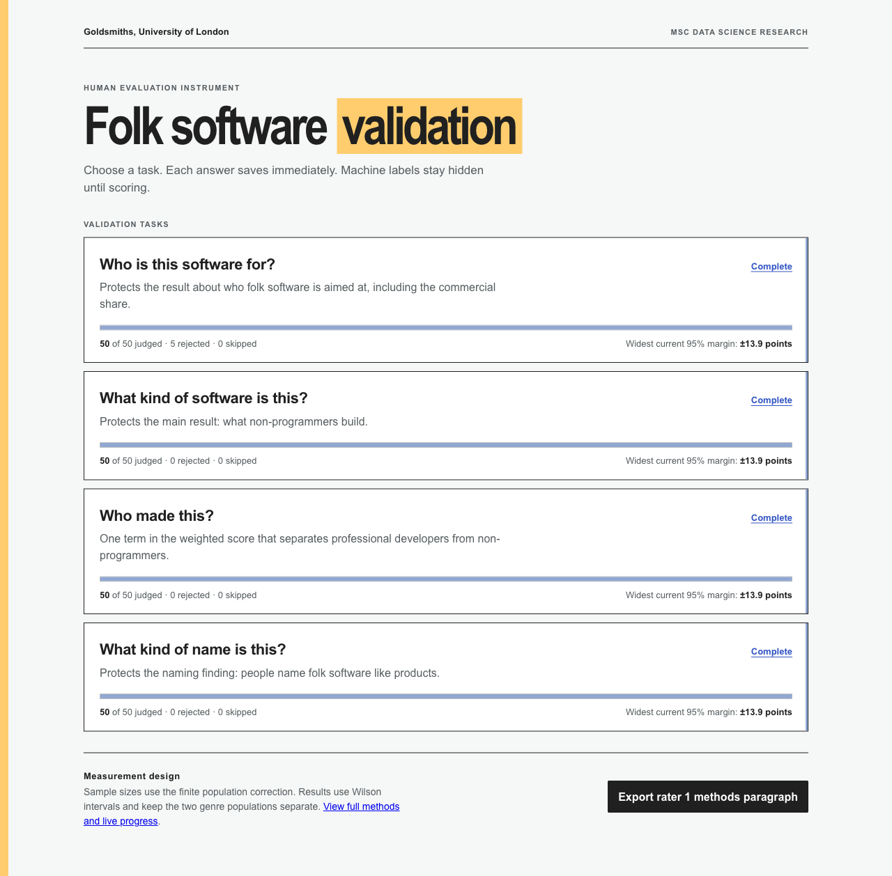

**Figure A1.** The evaluator's task menu at the end of labelling. Four blind tasks of 50 items each, one per judgement, all complete, each showing what has been judged, what was rejected from the corpus, and the 95 per cent margin the tool recomputes from the saved judgements. *Source file: figures/appendix_evaluator_menu.png.*

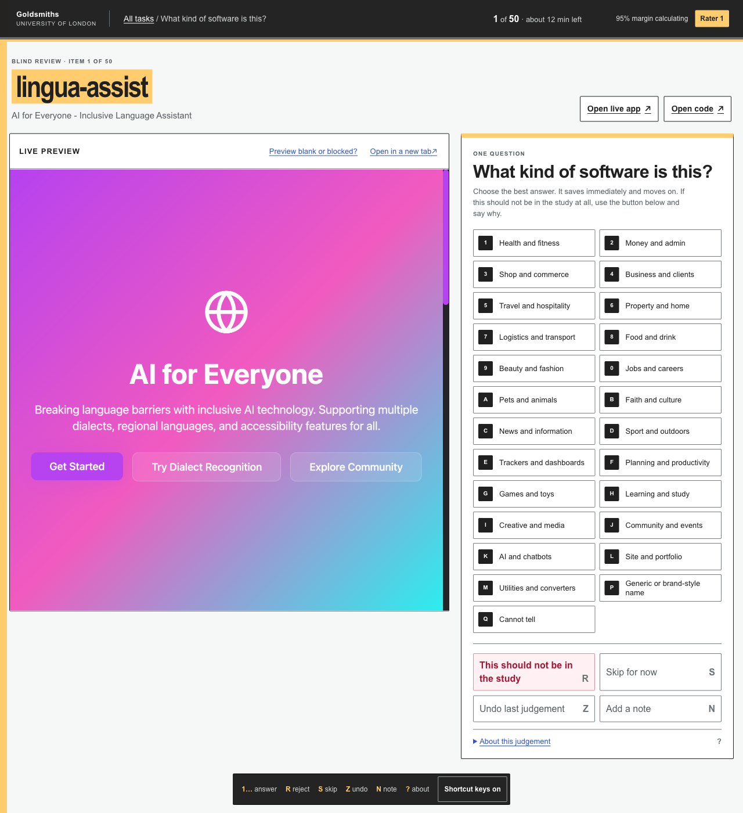

**Figure A2.** One blind judging screen in use. The judge sees the project's name, its page title, and the deployed app itself running in a live preview, with the fixed vocabulary beside it and its definitions and source one key away, and never a machine label. Judging is keyboard driven, and any item can be rejected from the corpus with a fixed reason, skipped, undone or annotated. *Source file: figures/appendix_evaluator_task.png.*

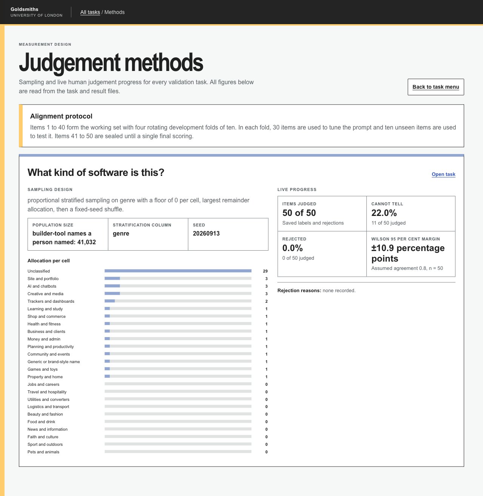

**Figure A3.** The evaluator's methods page, shown here for one of the four judgements. The tool states the alignment protocol, the sampling design with its seed and stratification column, the allocation per cell, and live progress including the cannot-tell share and the Wilson margin, every figure read from the task and result files rather than typed in. *Source file: figures/appendix_evaluator_methods.png.*

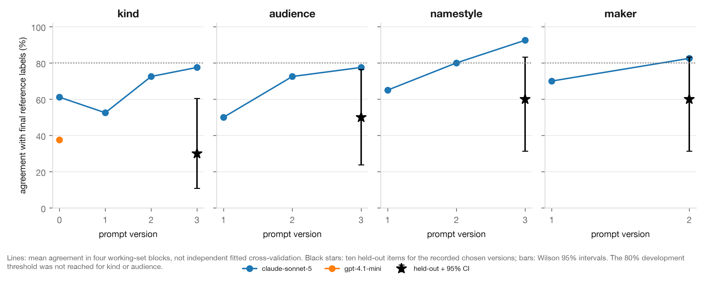

**Figure A4.** Development agreement by prompt version and final ten-item agreement for the selected versions. Final estimates carry Wilson 95% intervals. Development blocks are not independent cross-validation fits.

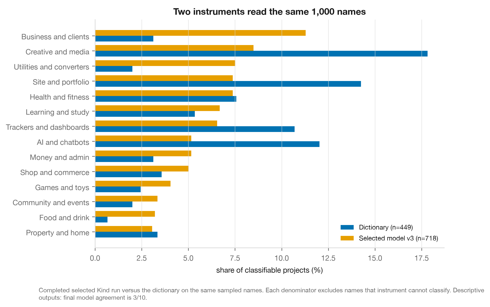

**Figure A5.** Dictionary and selected Kind coder outputs on the same completed 1,000-name sample. Each instrument uses its own classifiable denominator. The model's final agreement is 3/10, so the shares are exploratory.

**Appendix B. Provenance catalogue.** Signals and evidence grades are in `research/A-provenance-signals.md`. Maker-proxy evidence is in `research/J-detection-heuristics.md`.

**Appendix C. Data statement.** Sources, retrieval dates, terms of service, the anonymisation procedure and the column dictionary, in `data/README.md`.

**Appendix D. The next phase.** The survey and interview design that turns these proxies into ground truth, in `paper/phase-2-proposal.md`.
